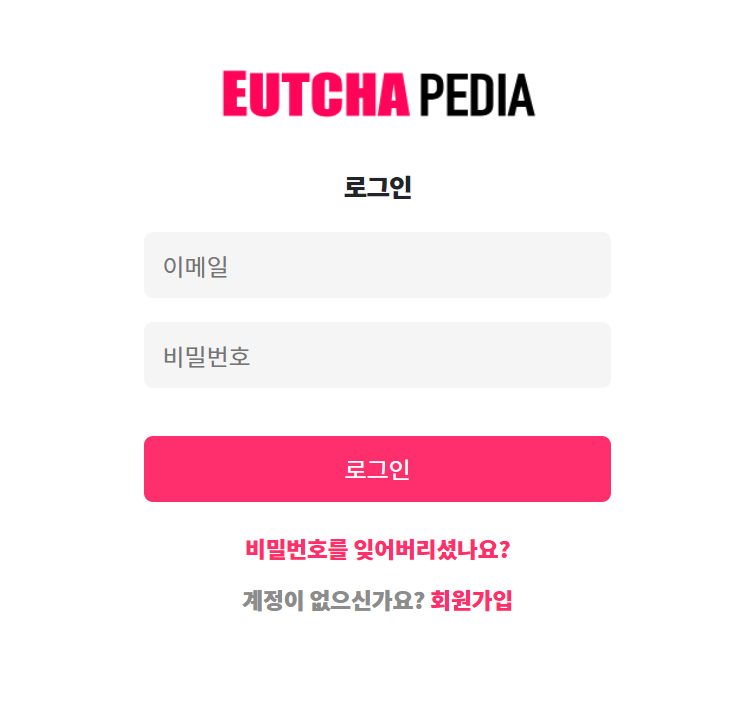

# 1. 프로젝트 설명

## 1.1. 프로젝트 명 
- Eutchapedia(읏챠피디아)
## 1.2. 프로젝트 수행기간 
- 2021.02.21 ~ 2021.03.03
## 1.3. 프로젝트 총 팀원 수
- 8명
## 1.4. 프로젝트 주제 소개
- 영화관에 가지 않고 OTT 서비스로 컨텐츠를 소비하는 경향이 두드러짐.
- 편리하게 영화에 대한 정보 및 평점, 리뷰를 확인할 수 있는 사이트를 만들고자 함.
## 1.5. 개발 환경
- OS: Windows 10 / macOS Big Sur 11.2
- Version Control: Github
- Framework: BootStrap, MyBatis, Spring Boot 2.4.2
- WireFrame: Kakao Oven
- Front-End: HTML5, CSS3, Javascript, jQuery, AJAX
- Back-End: Java 11.0.8
- WAS: Apache Tomcat 9.0
- DB: OracleDB, SqlDeveloper
- Developer Tools: Spring Tool Suite 4, VScode
- API: KMDB 영화상세정보 API
## 1.6. DB 설계
 

## 1.7. 구현 기능
- 회원 서비스
  - 메인, About us, 회원가입, 로그인, 비밀번호 재설정, 마이페이지
- 영화
  - 영화정보 상세보기, 검색, 컬렉션 상세보기, 별점 및 코멘트, 장르별 영화 모아보기
- 게시판
  - 공지사항, 자주하는 질문, 일대일 문의
- 관리자
  - 관리자 홈, PICK관리, 코멘트 블라인드 관리, 영화DB관리, 회원관리

## 1.8. 담당 역할
- 프로젝트 주제 아이디어 참여
- 회원가입, 로그인, 비밀번호 재설정, 컬렉션 상세보기 이미지 디자인 작업
- 회원가입, 로그인, SMTP를 이용한 비밀번호 재설정, 컬렉션(프론트엔드만) 기능

# 2. 프로젝트 내용
## 2.1. 회원가입 페이지
 
- 회원가입 페이지
- 유효성 검사 및 중복검사 할 수 있게 하였다
- 아래는 유효성 검사 모습 
 

## 2.2. 회원가입 완료 페이지
 
- 회원가입 완료 페이지
- 회원가입 때 사용한 이메일을 한 번 더 확인할 수 있게 하였다

## 2.3. 로그인 페이지
 
- 로그인 페이지
- 공백이 있을 시 alert창을 띄어 로그인 할 수 없게 하였다

## 2.4. 비밀번호 재설정 페이지
 
- 이메일 입력을 통한 비밀번호 재설정 페이지
- 사용자가 작성한 메일 주소로 인증번호를 받을 수 있게 하였다

## 2.5. 이메일로 받은 인증번호 입력 페이지
 
- 이메일로 받은 인증번호 입력 페이지
- 인증번호 입력했을 때 맞으면 비밀번호 변경 페이지로, 틀리면 현재 페이지로 남게 하였다

## 2.6. 비밀번호 변경 페이지
 
- 비밀번호 변경 페이지
- 유효성 검사 할 수 있게 하였다
- 입력한 비밀번호와 재입력한 비밀번호가 맞을 때만 비밀번호 변경할 수 있게 하였다
- 아래는 비밀번호 유효성 검사 모습 
   
   

  