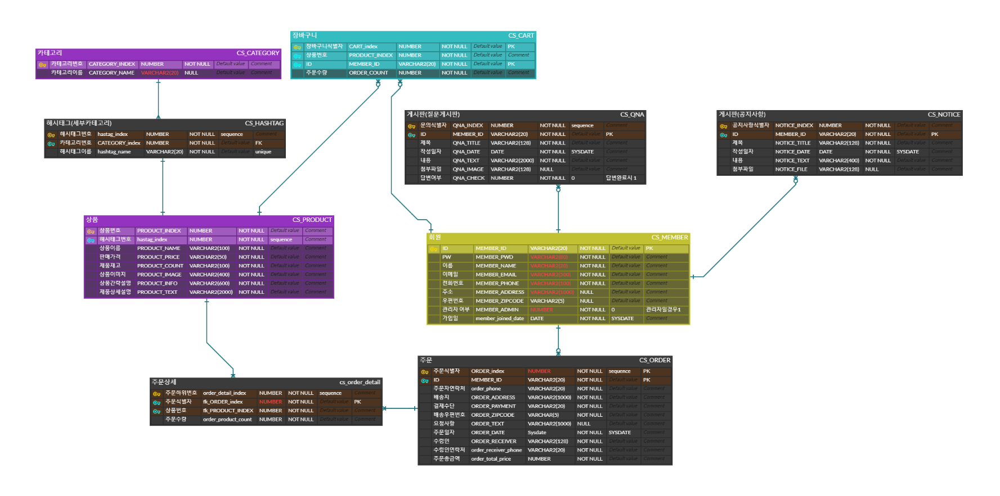
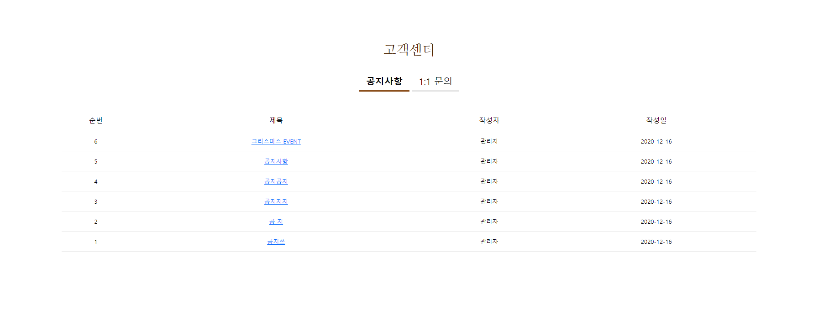

# 1. 프로젝트 설명

## 1.1. 프로젝트 명 
- COFFEESSAZO
## 1.2. 프로젝트 수행기간 
- 2020.12.01 ~ 2021.01.12
## 1.3. 프로젝트 총 팀원 수
- 7명
## 1.4. 프로젝트 주제 소개
- 새로운 서비스를 만들려고 하기보단 이미 존재하는 서비스를 '잘' 만들어보자.
- 많은 기능을 구현하려고 하기보단 적은 기능이라도 '완전히' 구현하는 것에 초점을 맞춤.
- 배운 것들을 활용할 수 있을만한 주제로 '쇼핑몰'을 선정함.
## 1.5. 개발 환경
- os : windows 10, macOS
- Version Control : Github
- Framework : Bootstrap
- WireFrame : Kakao oven
- Front-End : HTML5, CSS3, Javascript, jQUery, AJAX
- Back-End : Eclips EE 11.0.8
- DBMS : oracleDB, SqlDeveloper
- Developer Tools : Eclips EE 11.0.8, VScode
## 1.6. DB 설계
 
## 1.7. 구현 기능
- 회원 서비스
  - 회원가입, 로그인, 아이디 찾기, 비밀번호 재설정, 장바구니, 결제하기
- 게시판
  - 공지사항, 일대일문의
- 메인
  - 제품보기 페이지, 제품 상세보기 페이지

## 1.8. 담당 역할
- 프로젝트 주제 아이디어 참여
- 공지사항, 일대일 게시판 디자인 작업
- 공지사항, 일대일 게시판 CRUD 및 파일 첨부

# 2. 프로젝트 내용
## 2.1. 공지사항 페이지
 
- 공지사항 조회할 수 있는 페이지

## 2.2. 일대일문의 페이지
 
- 작성한 일대일 문의 글 조회 및 등록할 수 있는 페이지
- 로그인 시에만 글 등록 할 수 있게 하였다

## 2.3. 일대일문의 등록 페이지
 
- 일대일 문의 글 등록할 수 있는 페이지
- 필수 항목 작성할 시 등록 가능하게 하였다
- 파일 첨부도 가능

## 2.4. 일대일문의 조회 페이지
 
- 작성한 문의 글 조회할 수 있는 페이지
- 글 작성 시 등록한 파일도 보여줄 수 있게 하였다

## 2.5. 일대일문의 수정 페이지
 
- 작성만 문의 글 수정할 수 있는 페이지
- 필수 항목 작성할 시 수정 가능하게 하였다
- 파일 수정도 가능

  